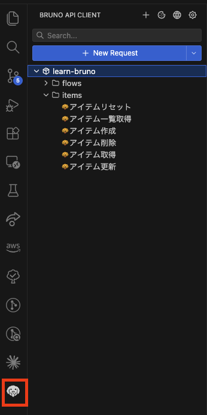
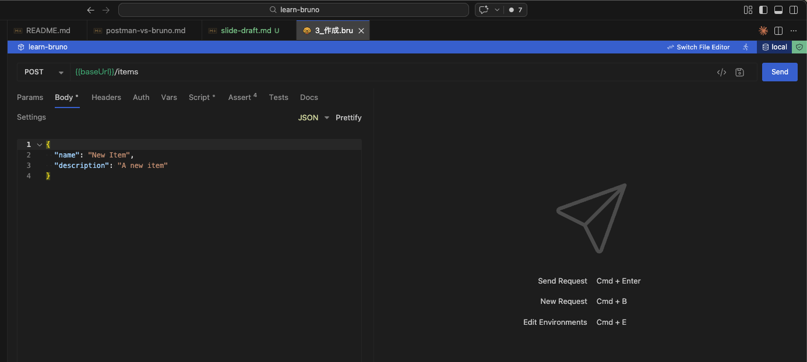
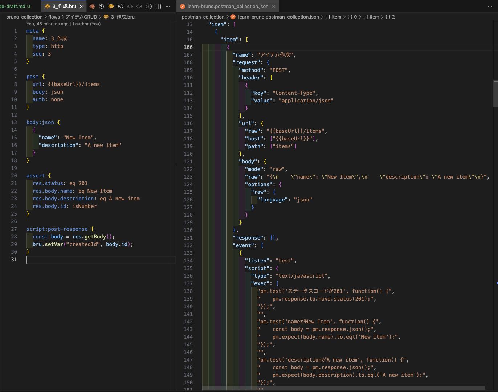
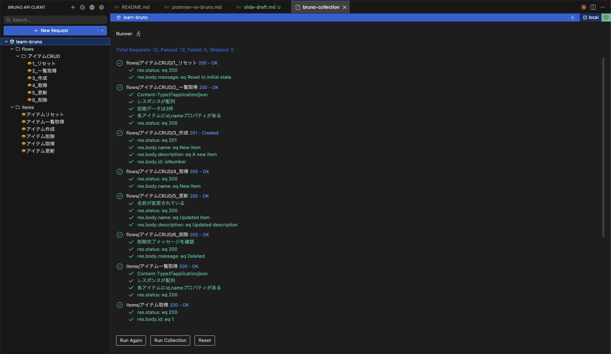
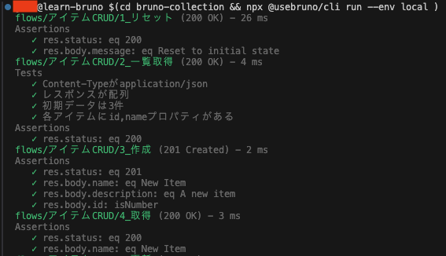
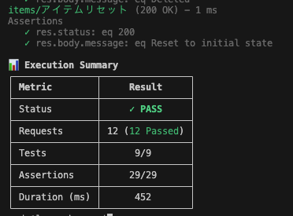
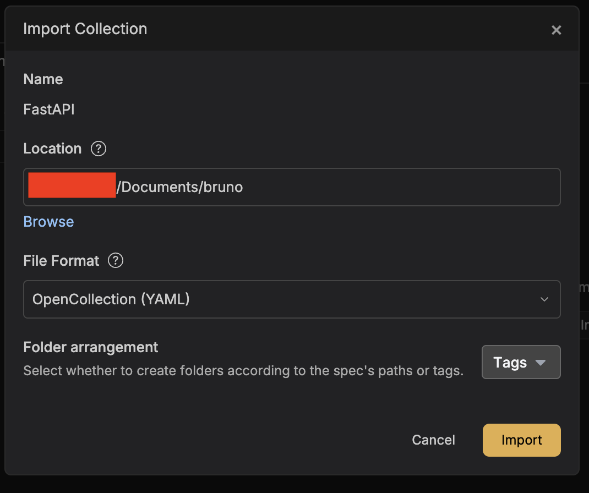

<!-- _class: lead -->

# Bruno — Git で管理できる API クライアント

発表者名
2026-03-23

---

## 今日話すこと

1. Bruno とは何か
2. コレクション作成デモ
3. テスト機能（assert / tests / フロー）
4. Postman との比較
5. CLI 実行
6. Git との相性
7. まとめ

---

## Bruno とは

- オープンソースの API クライアント（Postman の代替）
- 最大の特徴：**リクエスト定義がテキストファイル（.bru）**
- 1リクエスト = 1ファイル → Git でそのまま管理できる
- オフラインで動作、クラウド同期不要
- 無料（Golden Edition は有料だが基本機能は無料）


---

## Postman の課題感

- コレクションが巨大な JSON 1ファイル → **差分が読めない**
- クラウド同期前提 → オフラインや社内NW で不便
- 無料枠の制限（コレクション数、チーム機能など）
- テスト記述が JavaScript 必須で冗長

---

## Bruno のファイル構成

```
bruno-collection/
  bruno.json              ← コレクション設定
  collection.bru          ← 共通ヘッダー等
  environments/
    local.bru             ← 環境変数
  items/                  ← 単体リクエスト
    アイテム一覧取得.bru
    アイテム作成.bru
  flows/
    アイテムCRUD/          ← フローテスト
      1_リセット.bru
      2_一覧取得.bru
```

- 1リクエスト = 1ファイル、フォルダ構成がそのまま論理構造

---

## Bruno のファイル構成（GUI）



---

## .bru ファイルの中身

```bru
meta {
  name: アイテム作成
  type: http
  seq: 3
}

post {
  url: {{baseUrl}}/items
  body: json
  auth: none
}

body:json {
  {
    "name": "New Item",
    "description": "A new item"
  }
}

assert {
  res.status: eq 201
  res.body.name: eq "New Item"
  res.body.id: isNumber
}
```

---

## .bru ファイルのポイント

- 人間が読める
- テキストエディタで編集できる
- AI で生成できる



---

## Postman の同等定義との比較

| Bruno (.bru) | Postman (.json) |
|---|---|
| 約20行、読みやすい | ネストされた JSON、数十行 |



---

## テスト機能 — assert ブロック

```bru
assert {
  res.status: eq 200
  res.body.name: eq "New Item"
  res.body.id: isNumber
}
```

- **宣言的** に書ける（JavaScript 不要）
- Postman だと `pm.test()` + Chai で 10行以上必要

---

## テスト機能 — tests ブロック

```bru
tests {
  test("Content-Typeがapplication/json", function() {
    expect(res.getHeader('content-type'))
      .to.include('application/json');
  });
  test("レスポンスが配列", function() {
    const body = res.getBody();
    expect(body).to.be.an('array');
  });
}
```

- 複雑なテストは JavaScript（Chai）で記述可能
- Postman の `pm.test()` とほぼ同じ書き味

---

## テスト機能 — 変数の受け渡し

```bru
# 作成リクエストの post-response で変数をセット
script:post-response {
  const body = res.getBody();
  bru.setVar("createdId", body.id);
}

# 取得リクエストの pre-request で変数を検証
script:pre-request {
  const id = bru.getVar("createdId");
  if (!id) {
    throw new Error("createdId is not set.");
  }
}
```

- `bru.setVar()` / `bru.getVar()` でリクエスト間の値受け渡し

---

## フローテスト

| seq | リクエスト | やっていること |
|-----|-----------|---------------|
| 1 | リセット | データ初期化 |
| 2 | 一覧取得 | 初期状態の確認 |
| 3 | 作成 | → `createdId` を保存 |
| 4 | 取得 | `createdId` で取得 |
| 5 | 更新 | `createdId` で更新 |
| 6 | 削除 | `createdId` で削除 |

- `seq` プロパティで実行順を定義
- Runner または CLI で一括実行

---

## フローテスト実行結果



---

## Postman との比較 — 機能面

| 観点 | Postman | Bruno |
|------|---------|-------|
| 保存形式 | JSON（クラウド or エクスポート） | `.bru` テキストファイル |
| バージョン管理 | クラウド履歴 / Git 連携は手動 | そのまま Git 管理 |
| 編集方法 | GUI のみ | GUI + エディタ + AI |
| テスト記述 | JavaScript 必須 | 宣言的 `assert` + JS も可 |
| CLI | `newman` | `@usebruno/cli` |

---

## Postman との比較 — セキュリティ・料金

| 観点 | Postman | Bruno |
|------|---------|-------|
| データ保存先 | クラウド（リクエスト・変数・トークン含む） | ローカルのみ |
| リクエスト送信 | プロキシサーバー経由 | PC から直接送信 |
| AI 学習への利用 | 入力データを学習に利用する旨の規約あり | クラウド非依存、データ送信なし |
| 料金 | 無料枠に制限あり | 基本機能は無料 |

> 公式比較: https://www.usebruno.com/compare/bruno-vs-postman

---

## CLI 実行デモ

```bash
cd bruno-collection
npx @usebruno/cli run --env local flows/アイテムCRUD
```

- CI/CD パイプラインに組み込み可能
- テスト結果がターミナルに出力される

---

## CLI 実行結果





---

## Git との相性

### Bruno: 1リクエスト = 1ファイル → レビューしやすい

- PR で変更されたファイルを見れば、どのリクエストが変わったか一目瞭然
- `.bru` はテキストなので diff が自然に読める
- コンフリクトもリクエスト単位で解消できる

### Postman: 全リクエストが1つの JSON → レビューが困難

- 1箇所の変更でも JSON 構造全体に影響が波及しうる
- ネストが深く、diff のノイズが多い

---

## Secret 管理・その他

- `.env` ファイルでシークレット変数を管理
  - `.gitignore` に入れれば Git に載らない
  - Postman はクラウドに環境変数が同期されるリスク
- OpenAPI からのインポート機能あり
  - Postman コレクションからのインポートも可能



---

## まとめ — Bruno を選ぶ理由

1. **Git フレンドリー** — テキストファイルなので差分管理が自然
2. **宣言的テスト** — `assert` ブロックで簡潔に書ける
3. **オフライン・無料** — クラウド依存なし
4. **CI/CD 対応** — CLI でパイプラインに組み込める
5. **移行が容易** — Postman コレクションをインポート可能

---

<!-- _class: lead -->

# Q&A

質問タイム
